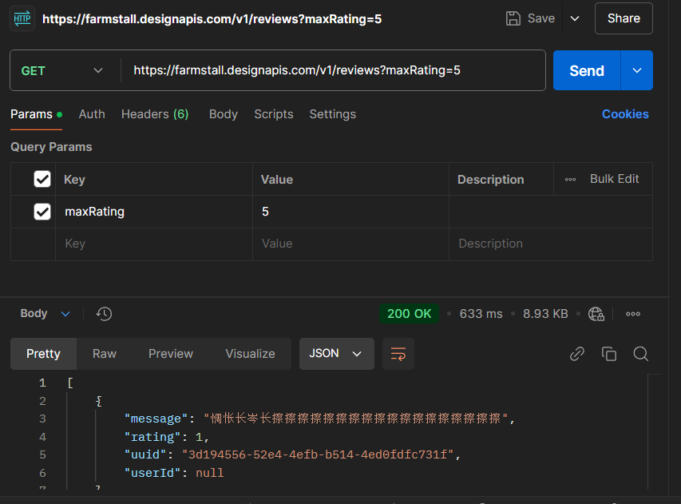
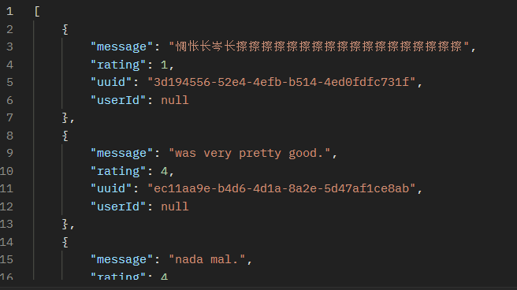

## **후기 목록 조회**

2장 첫 부분에서 설명한 것처럼 GET 요청을 보내서 후기 목록을 받아볼 것이다.
세부 내용은 아래와 같이 정리돼 있다.
GET /reviews 요청에는 숫자 1에서 5까지의 값을 가질 수 있는 maxRating 쿼리 파라미터가 포함돼 있다.

```
메서드(GET)
URI(/reviews)
쿼리 파라미터(maxRating(1~5))
본문(N/A)
```

URI 값은 상대 경로로 표시했는데, API는 https://farmstall.designapis.com/v1 에서 호스팅되고 있으므로 GET /reviews 요청의 전체 경로는 다음과 같다.

```
https://farmstall.designapis.com/v1/reviews
```

여기에 쿼리 파라미터를 추가하면 최종 URL은 다음과 같다.

```
https://farmstall.designapis.com/v1/reviews?maxRating=5
```

URL이 정해졌으면 GET 요청을 보낼 준비는 완료된 것이다.
이제 포스트맨을 사용해 요청을 보내보자.

### **GET 요청 구성**

아직 포스트맨을 실행하지 않았다면 이제 실행해보자. 
다음에는 GET 요청을 보낼 때 사용되는 주요 화면 요소가 포함돼 있다.



* 메서드 드롭다운: 사용할 HTTP 메서드를 선택한다. 기본값은 GET이며 다른 메서드를 선택할 수 있다.
* URL 입력란: 요청을 전송할 API 엔드포인트 URL을 입력할 수 있다.
* 요청 전송 버튼: 버튼을 클릭하면 요청이 전송된다.

엔드포인트에 전송할 요청을 만들어 보내려면 URL 입력란에 URL을 입력하고 Send 버튼을 클릭해야 한다.
포스트맨의 URL 입력란에 https://farmstall.designapis.com/v1/reviews?maxRating=5 를 입력하고 Send 버튼을 클릭하면 
다음과 같이 JSON 데이터가 화면에 표시될 것이다. 이 데이터가 바로 요청 실행 결과다.
JSON 데이터가 화면에 표시됐다면 요청이 성공적으로 처리된 것이다.

```
무언가 잘못돼서 정상적인 응답 대신 에러가 발생할 수 있다.
입력한 URL에 오타가 있을 수도 있고, 서버 상태가 정상이 아닐 수도 있으며, 예측하지 못한 문제가 있어서 에러가 났을 수도 있다.
일단 요청을 제대로 보낸 것이 확실하면 그것으로 충분하다.
```



### **확인**

요청에 대한 응답을 보냈다면 API가 요청을 정상적으로 처리했고 우리가 API에 접근하는 데 문제가 없음을 확인한 것이다.
응답 데이터는 위와 모양새가 비슷할 것이다.

요청 실행 결과 예상했던 후기 목록 데이터를 응답 데이터를 응답으로 받은 것을 확인했다.
나중에 이 데이터를 기술해야 알지만 일단 지금은 요청 전송에 성공했고, 요청이 잘 처리되어 응답 데이터를 받았음을 확인한 것만으로도
충분하다. 이제 POST 요청으로 새 후기를 남겨보자.