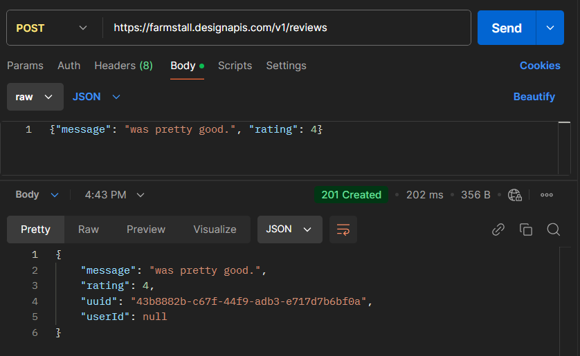

## **후기 남기기**

직판장 API를 사용해 후기를 남기는 데 사용할 요청은 POST /reviews이며 다음과 같이 정리돼 있다.
쿼리 파라미터는 없지만 요청 본문을 포함하고 있다. 이번에는 요청에 대한 응답 내용은 그다지 중요하지 않으며,
API를 사용해 데이터를 저장했다는 사실이 중요하다.

```
메서드(POST)
URI(/reviews)
쿼리 파라미터(N/A)
본문({"message": "was pretty good.", "rating": 4})
```

GET 요청과 POST 요청의 가장 큰 차이는 요청 본문이다.
쿼리 파라미터를 사용해 데이터를 전송할 수도 있지 않을까 생각할 수도 있겠지만, 쿼리 파라미터에는 길이 제한, 바이너리 데이터 사용 불가 등의 
제약사항이 아주 많다. 
요청 본문에는 이런 제약이 없다. 길이 제한은 사실상 없고 사용성 측면에서의 제약이 있을 뿐이며 바이너리 데이터도 전송할 수 있다.

```
요청 본문에 데이터를 담아 보낼 때 얻을 수 있는 흥미로운 장점은 보안성이다.
쿼리 파라미터는 URL의 일부라서 서버나 프록시 로그에 그대로 기록될 수 있다.
비밀 정보를 쿼리 파라미터에 담아 보내면 클라이언트와 서버 사이 어디에선가 기록될 수 있으므로 보안 위험이 있다.
요청 본문은 일반적으로 프록시에서 처리되지 않으며 로그로 기록되지도 않는다.
```

### **POST 요청 구성**

POST /reviews 요청에는 JSON 형식의 요청 본문이 필요하다.
요청 본문에 담아서 보낼 후기 정보는 message와 rating 필드를 포함하는 객체이다.

* message: 직판장 사용 경험에 대한 피드백을 나타내는 문자열이다.
* rating: 직판장 사용 경험에 대한 평점을 의미하며 최저 1, 최고 5점이다.

요청 본문을 JSON 형식으로 작성하면 다음과 같다.

```
{
    "message": "was pretty good.",
    "rating": 4
}
```

GET 요청을 보낼 때와 마찬가지로 전체 경로를 구성하면 다음과 같다.

```
https://farmstall.designapis.com/v1/reviews
```

이제 요청을 전송하기 위해 포스트맨에서 해야할 일을 정리하면 다음과 같다.

1. HTTP 메서드를 POST로 변경한다.
2. URL 입력란에 https://farmstall.designapis.com/v1/reviews
3. 앞서 작성한 JSON을 입력할 수 있도록 Body 탭을 선택하고 raw를 클릭한다.
4. Content-Type을 JSON으로 설정한다.
5. 앞서 작성한 JSON을 입력한다.

4번 단계에서 Content-Type이라는 특수 헤더 정보를 설정하는데, API 서버는 이 헤더 값을 토대로 데이터가 어떤 미디어 타입인지 판단한다.
미디어 타입은 나중에 다시 다룬다. 포스트맨 UI가 변경될 수 있으므로 이 Content-Type 헤더 정보가 바르게 설정됐는지 다시 한 번 확인하자.

위의 5 단계 작업이 다음과 같으니 그대로 따라 수행해보자.



응답 상태 코드가 201 Created인 것을 확인할 수 있다.
201은 자원이 생성(Created)되었음을 의미하는 HTTP 상태 코드 값이다.
아래 예제에는 응답 본문이 나와 있다.

```
{
    "message": "was pretty good.",
    "rating": 4,
    "uuid": "43b8882b-c67f-44f9-adb3-e717d7b6bf0a",
    "userId": null
}
```

요청을 만들어서 전송하고 실행하는 데 전송(sending), 실행(executing), 호출(calling), 요청(requesting) 등 여러 용어를 사용하는데
의미는 모두 같다. 어느 용어를 사용해도 무방하지만 혼동될 때는 '실행'을 사용하자.

### **확인**

