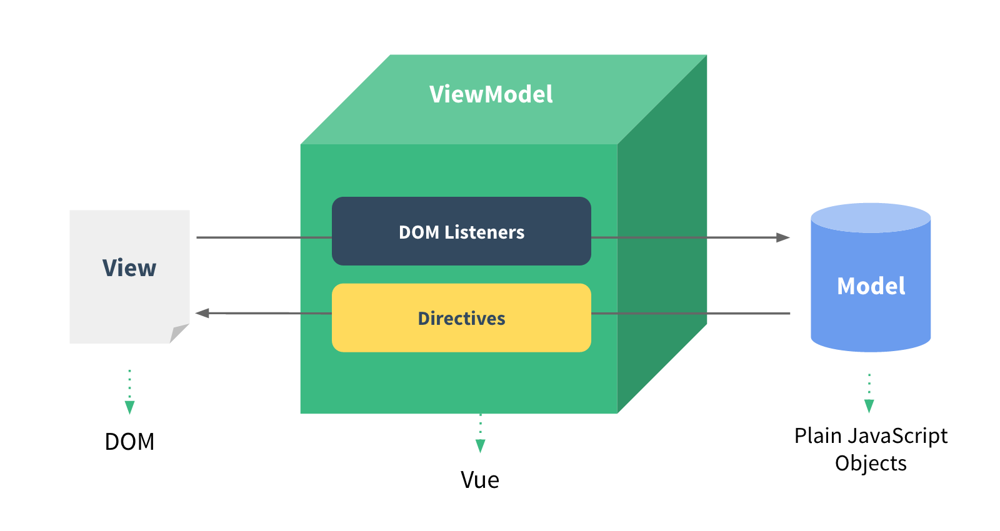
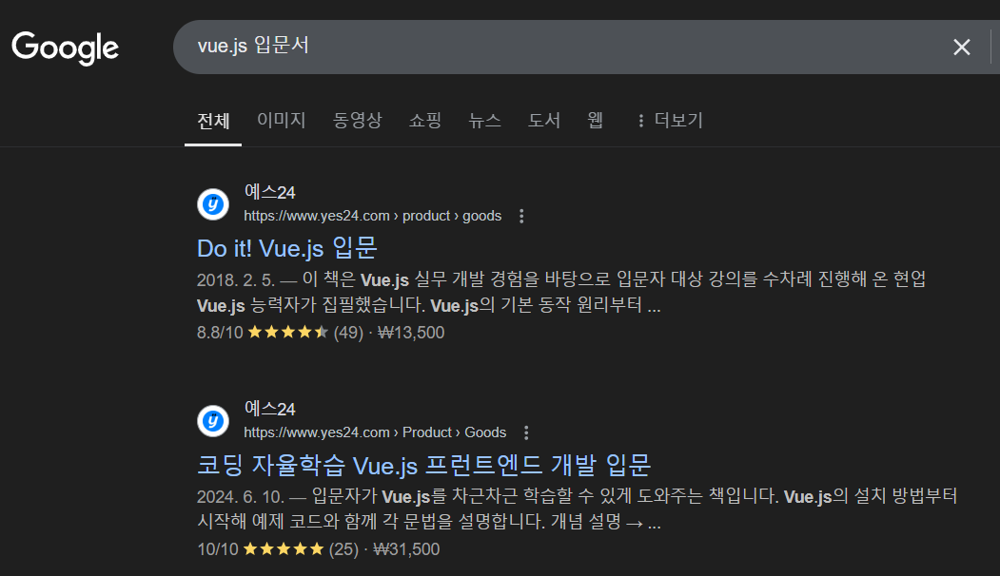

## **01-2 Vue.js의 특징**

### **UI 화면단 라이브러리**

뷰는 UI 화면 개발 방법 중 하나인 MVVM 패턴의 뷰 모델(ViewModel)에 해당하는 화면단 라이브러리이다.

위 그림에서 볼 수 있듯이 MVVM 패턴이란 화면을 모델(Model)-뷰(View)-뷰 모델(ViewModel)로 구조화하여 개발하는 방식을 의미한다.
이러한 방식으로 개발하는 이유는 화면의 요소들을 제어하는 코드와 데이터 제어 로직을 분리하여 코드를 더 직관적으로 이해할 수 있고,
추후 유지 보수가 편해지기 때문이다.
좀 더 쉽게 이해하기 위해 위 구조도의 용어를 하나하나 살펴보도록 하겠다.

* 뷰(View): 사용자에게 보여지는 UI 
* 돔(Dom): HTML 문서에 들어가는 요소(태그, 클래스, 속성 등)의 정보를 담고 있는 데이터 트리
* 돔 리스너(Dom Listener): 돔의 변경 영역에 대해 즉각적으로 반응하여 특정 로직을 수행하는 장치
* 모델(Model): 데이터를 담는 용기, 보통은 서버에서 가져온 데이터를 자바스크립트 객체 형태로 저장
* 데이터 바인딩(Data Binding): 뷰(View)에 표시되는 내용과 모델의 데이터를 동기화
* 뷰 모델(View Model): 뷰와 모델의 중간 영역. 돔 리스너와 데이터 바인딩을 제공하는 영역

#### **MVVM 구조의 처리 흐름**

앞 구조도의 처리 흐름을 이해하기 위해 구글 사이트에서 검색어를 입력하여 살펴보겠다.
사이트에 접속하여 검색 창에 검색어를 입력하고 [google 검색] 버튼을 클릭한다.

여기서 뷰(View)는 사용자에게 비춰지는 구글 검색 화면 전체를 의미한다.
그리고 돔(DOM)은 구글 로고, 검색창, 키보드와 마이크 아이콘, [Google 검색] 버튼 등 화면에 나타나는 HTML 문서 상의 모든 요소를 의미한다.
[Google 검색] 버튼을 클릭하면 아래와 같은 검색 결과가 나타난다.

[Google 검색] 버튼을 클릭했을 때 돔 리스너(DOM Listenter)에서 버튼의 클릭을 감지한다.
그리고 버튼이 동작하면 검색 결과를 보여주는 로직이 처리된다.
이 처리 과정에서 데이터 바인딩(Data Binding)이 관여하는데, 검색 결과에 해당하는 데이터를 모델(Model)에서 가져와 화면에 나타내 준다.
다른 단어를 검색해도 처리 과정은 같다.

이처럼 뷰는 화면의 요소가 변경되거나 조직이 일어날 때 즉각적으로 반응하여 화면의 데이터를 갱신하여 보여 주는 역할을 한다.
화면의 표현에 주로 관여하는 라이브러리이기 때문에 화면단 라이브러리라고도 한다.

위에서는 MVVM 구조에서의 뷰를 쉽게 설명하기 위해 친숙한 구글 검색 사이트의 검색 과정을 예로 들었다.
그렇다고 구글 사이트가 실제 뷰로 제작된 것은 아니다.
다른 기술로 구현되어 있으니 이 점을 참고하기 바란다.

### **컴포넌트 기반 프레임워크**

뷰가 가지는 또 하나의 큰 특징은 바로 컴포넌트(Component) 기반 프레임워크라는 점이다.

컴포넌트란 마치 레고 블럭과 같다. 레고 블럭을 잘 조립해서 쌓으면 원하는 모형을 만들 수 있듯이 뷰의 컴포넌트를 조합하여 화면을 구성할 수 있다.
최신 프런트엔드 프레임워크인 리액트, 앵귤러 모두 컴포넌트 기반의 개발 방식을 추구하고 있다.
컴포넌트 기반 방식으로 개발하는 이유는 코드를 재사용하기 쉽기 때문이다.
그리고 뷰의 컴포넌트를 썼을 때 HTML 코드에서 화면의 구조를 직관적으로 파악할 수 있다.
따라서 프레임워크 자체에서 컴포넌트 방식을 추구하면 모두가 정해진 방식대로 컴포넌트를 활용하므로 빠르게 구현할 수 있을 뿐만 아니라
남이 작성한 코드를 볼 때도 수월해진다.

### **리액트와 앵귤러의 장점을 가진 프레임워크**

뷰는 앵귤러의 양방향 데이터 바인딩(Tow-way Data Binding)과 리액트의 단방향 데이터 흐름(One-way Data Flow)의 장점을 모두 결합한 프레임워크이다.
양방향 데이터 바인딩이란 화면에 표시되는 값과 프레임워크의 모델 데이터 값이 동기화되어 한쪽이 변경되면 다른 한쪽도 자동으로 변경되는 것을 말한다.
단방향 데이터 흐름은 컴포넌트의 단방향 통신을 의미한다. 컴포넌트 간에 데이터를 전달할 때 항상 상위 컴포넌트에서 하위 컴포넌트 한 방향으로 전달하게끔
프레임워크가 구조화되어 있는 게 바로 단방향 데이터 흐름이다.

이 외에도 빠른 화면 렌더링(Redering)을 위해 리액트의 가상 돔(Vritual DOM) 렌더링 방식을 적용하여 사용자 인터렉션(Interaction)이 많은 
요즘의 웹 화면에 적합한 동작 구조를 갖추고 있다. 가상 돔을 활용하면 특정 돔 요소를 추가하거나 삭제하는 변경이 일어날 때 화면 전체를 다시 그리지 
않고 프레임워크에서 정의한 방식에 따라 화면을 갱신한다. 따라서 브라우저 입장에서는 성능 부하가 줄어들어 일반 렌더링 방식보다 더 빠르게 화면을 그릴 수 있다.

이와 같이 뷰는 대중적인 프레임워크인 리액트, 앵귤러의 장점을 살려 제작되었기 때문에 기존 리액트, 앵귤러 개발자도 쉽게 배울 수 있다.
또 새로 입문하는 사람들은 다른 프레임워크에 대한 이해도를 높일 수 있어 차후에 다른 프레임워크도 쉽게 학습할 수 있다.