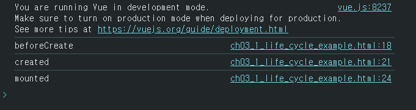

# **뷰 인스턴스**

## **뷰 인스턴스의 정의와 속성**

뷰 인스턴스(Instance)는 뷰로 화면을 개발하기 위해 필수적으로 생성해야 하는 기본 단위이다.
앞 장에서 'Hello Vue.js!' 텍스트가 화면에 표시된 것은 인스턴스가 있었기 때문에 가능한 것이다.
이처럼 인스턴스는 뷰로 화면을 개발하기 위한 필수 조건이다.

### **뷰 인스턴스 생성**

뷰 인스턴스를 사용하기 위해서는 아래와 같은 형식으로 생성한다.

```
<html>
    <head>
        <title>Vue Sample</title>
    </head>
    <body>
        <div id="app">
            {{ message }}
        </div>
        <script src="https://cdn.jsdelivr.net/npm/vue@2.5.2/dist/vue.js"></script>
        <script>
            new Vue({   // Vue 인스턴스 생성
                el: '#app', // el 속성
                data: { // data 속성성
                    message: 'Hell Vue.js!'
                }
            });
        </script>
    </body>
</html>
```

먼저 'Hello Vue.js!' 텍스트를 화면에 표시하기 위해 new Vue()로 뷰 인스턴스를 생성했다.
그리고 인스턴스 안에 el 속성으로 뷰 인스턴스가 그려질 지점을 지정하고,
data 속성에 message 값을 정의하여 화면의 {{ message }}에 연결했다. 그럼 각 요소에 대해 자세히 알아보도록 하자.

### **뷰 인스턴스 생성자**

new Vue()로 인스턴스를 생성할 때 Vue 생성자라고 한다.
Vue 생성자는 뷰 라이브러리를 로딩하고 나면 접근할 수 있다.
생성자를 사용하는 이유는 뷰로 개발할 때 필요한 기능들을 생성자에 미리 정의해 놓고 사용자가 그 기능을 재정의하여 편리하게 사용하도록 하기 위함이다.

## **뷰 인스턴스 옵션 생성**

뷰 인스턴스 옵션 속성은 인스턴스를 생성할 때 재정의할 data, el, template 등의 속성을 의미한다.
예컨대 Hello Vue.js! 예제에서는 data라는 미리 정의되어 있는 속성을 사용했다.
우리는 그 안에 message라는 새로운 속성을 추가하고 Hello Vue.js! 라는 값을 주었을 뿐이다.
el 속성 역시 미리 정의되어 있어 뷰로 만든 화면이 그려지는 시작점을 의미한다.
뷰 인스턴스로 화면을 렌더링할 때 화면이 그려질 위치의 돔 요소를 지정해 주어야 한다.

```
<div id="app"
    {{ message }}
</div>

new Vue({
    el: "#app",
});
```

여기서 #app 값은 화면의 요소 중 app이라는 아이디를 가진 요소를 의미한다.
여기서 사용한 # 선택자는 CSS 선택자 규칙과 같다.
이 외에도 template, methods, created 등 미리 정의되어 있는 속성을 사용할 수 있다.

* template: 화면에 표시할 HTML, CSS 등의 마크업 요소를 정의하는 속성, 뷰의 데이터 및 기타 속성들도 함께 화면에 그릴 수 있으며 5장의 뷰 템플릿에서 자세히 설명할 예정이다.
* methods: 화면 로직 제어와 관계된 메서드를 정의하는 속성. 마우스 클릭 이벤트 처리와 같이 화면의 전반적인 이벤트와 화면 동작과 관련된 로직을 추가할 수 있다.
* created: 뷰 인스턴스가 생성되자마자 실행할 로직을 정의할 수 있는 속성. 뷰 인스턴스 라이프 사이클 부분에서 추가로 설명할 예정이다.

## **뷰 인스턴스 유효 범위**

### **뷰 인스턴스 유효 범위란?**

뷰 인스턴스를 생성하면 HTML의 특정 범위 안에서만 옵션 속성들이 적용되어 나타난다.
이를 뷰 인스턴스의 유효 범위라고 한다. 다음 절에서 다루는 지역 컴포넌트와 전역 컴포넌트의 차이점을 이해하기 위해서도 꼭 알아야 하는 개념이며,
인스턴스의 유효 범위는 el 속성과 밀접한 관계가 있다.

인스턴스 유효 범위를 이해하려면 인스턴스가 생성된 후 화면에 어떻게 적용되는지 알아야 한다.
new Vue()로 인스턴스를 생성하고 나서 화면에 인스턴스 옵션 속성을 적용하는 과정은 다음과 같다.

```
뷰 라이브러리 파일 로딩 -> 인스턴스 객체 생성(옵션 속성 포함) -> 특정 화면 요소에 인스턴스를 붙임 -> 인스턴스 내용이 화면 요소로 변환 -> 변환된 화면 요소를 사용자가 최종 확인
```

이 과정을 이해하기 위해 Hello Vue.js 샘플 코드의 인스턴스 정의 부분을 자세히 살펴보겠다.

```
new Vue({
    el: '#app',
    data: {
        message: 'Hello Vue.js!'
    }
});
```

먼저 자바스크립트 코드 상에서 인스턴스 옵션 속성 el과 data를 인스턴스에 정의하고 new Vue()로 인스턴스를 생성한다.
그리고 브라우저에서 위 샘플 코드를 실행하면 아래와 같이 el 속성에 지정한 화면 요소(돔)에 인스턴스가 부착된다.

```
<div id="app">
    {{ message }}
</div>
```

el 속성에 인스턴스가 부착되고 나면 인스턴스에 정의한 옵션 객체의 내용(data 속성)이 el 속성에 지정한 화면 요소와 그 이하 레벨의 화면 요소에 적용되어 값이 치환된다.

```
<div id="app">
    {{ message }}
</div>  // message <- 'Hello Vue.js!'
```

data 속성이 message 값 Hello Vue.js!가 {{ message }}와 치환된다.

```
<div id="app">
    Hello Vue.js!
</div>
```

### **인스턴스의 유효 범위 확인**

그런데 만약 인스턴스의 유효 범위를 벗어나면 어떻게 될까? 앞에서 살펴본 코드를 살짝 변경해보겠다.

```
<div id="app">

</div>
{{ message }}
```

message 속성의 값이 Hello Vue.js!로 바뀌지 않고 그대로 출력되는 이유는 인스턴스의 유효 범위 때문이다.
현재 코드에서 인스턴스의 유효 범위는 el 속성으로 지정한 <div id="app"> 태그 아래에 오는 요소들로 제한된다.
따라서 <div> 태그 바깥에 있는 {{ message }}는 뷰에서 인식하지 못하기 때문에 Hello Vue.js!로 바뀌지 않고 {{ message }} 그대로 출력된다.

## **뷰 인스턴스 라이프 사이클**

앞에서 살펴본 인스턴스의 속성 중 created를 떠올려 보자.
인스턴스가 생성되었을 때 호출할 동작을 정의하는 속성이라고 설명했다.
이처럼 인스턴스의 상태에 따라 호출할 수 있는 속성들을 라이프 사이클(life cycle) 속성이라고 한다.
그리고 각 라이프 사이클 속성에서 실행되는 커스텀 로직을 라이프 사이클 훅(hook)이라고 한다.

라이프 사이클 속성에는 created, beforCreate, beforMount, mounted 등 인스턴스의 생성, 변경, 소멸과 관련되어 총 8개가 있다.

라이프 사이클 단계를 크게 나누면 인스턴스의 생성, 생성된 인스턴스를 화면에 부착, 화면에 부착된 인스턴스의 내용이 갱신, 인스턴스가 제거되는 소멸의 4 단계로 이루어진다. 부착 -> 갱신 구간은 데이터가 변경되는 경우에만 거치게 된다.
그리고 각 단계 사이에 라이프 사이클 속성이 실행된다.
그럼 각 라이프 사이클 속성을 좀 더 자세히 살펴보겠다.

* beforeCreate: 인스턴스가 생성되고 나서 가장 처음으로 실행되는 라이프 사이클 단계. data 속성과 methods 속성이 아직 인스턴스에 정의되어 있지 않고, 돔과 같은 화면 요소에도 접근할 수 없다.
* created: beforeCreate 라이프 사이클 단계 다음에 실행되는 단계. data 속성과 methods 속성이 정의되었기 때문에 this.data 또는 this.fetch.Data()와 같은 로직들을 이용하여 data 속성과 methods 속성에 정의된 값에 접근하여 로직을 실행할 수 있다. 다만, 아직 인스턴스가 화면 요소에 부착되기 전이기 때문에 template 속성에 정의된 돔 요소로 접근할 수 없다.
* beforeMount: created 단계 이후 template 속성에 지정한 마크업 속성을 render() 함수로 변환한 후 el 속성에 지정한 화면 요소(돔)에 인스턴스를 부착하기 전에 호출되는 단계이다. render() 함수가 호출되기 직전의 로직을 추가하기 좋다.
* mounted: el 속성에서 지정한 화면 요소에 인스턴스가 부착되고 나면 호출되는 단계로, template 속성에 정의한 화면 요소(돔)에 접근할 수 있어 화면 요소를 제어하는 로직을 수행하기 좋은 단계이다. 다만, 돔에 인스턴스가 부착되자마자 바로 호출되기 때문에 하위 컴포넌트나 외부 라이브러리에 의해 추가된 화면 요소들이 최종 HTML 코드로 변환되는 시점과 다를 수 있다.
* beforeUpdate: el 속성에서 지정한 화면 요소에 인스턴스가 부착되고 나면 인스턴스에 정의한 속성들이 화면에 치환된다. 치환된 값은 뷰의 반응성(Reactivity)을 제공하기 위해 $watch 속성으로 감시한다. 이를 데이터 관찰이라고 한다.
* updated: 데이터가 변경되고 나서 가상 돔으로 다시 화면을 그리고 나면 실행되는 단계이다. 데이터 변경으로 인한 화면 요소 변경까지 완료된 시점이므로, 데이터 변경 후 화면 요소 제어와 관련된 로직을 추가하기 좋은 단계이다. 이 단계에서 데이터 값을 변경하면 무한 루프에 빠질 수 있기 때문에 값을 변경하려면 computed, watch와 같은 속성을 사용해야 한다. 따라서 데이터 값을 갱신하는 로직은 가급적이면 beforeUpdate에 추가하고, updated에서는 변경 데이터의 화면 요소(돔)와 관련된 로직을 추가하는 것이 좋다.
* beforeDestroy: 뷰 인스턴스가 파괴되기 직전에 호출되는 단계이다. 이 단계에서는 아직 인스턴스에 접근할 수 있다. 따라서 뷰 인스턴스의 데이터를 삭제하기 좋은 단계이다.
* destroyed: 뷰 인스턴스가 파괴되고 나서 호출되는 단계이다. 뷰 인스턴스에 정의한 모든 속성이 제거되고 하위에 선언한 인스턴스들 또한 모두 파괴된다.

지금까지 설명한 라이프 사이클 훅이 실제로 어떻게 동작하는지 확인하기 위해 예제를 통해 실습해보겠다.

```
<html>
    <head>
        <title>Vue Instance</title>
    </head>
    <body>
        <div id="app">
            {{ message }}
        </div>

        <script src="https://cdn.jsdelivr.net/npm/vue@2.5.2/dist/vue.js"></script>
        <script>
            new Vue({
                el: '#app',
                data: {
                    message: 'Hello Vue.js!'
                },
                beforeCreate: function() {
                    console.log("beforeCreate");
                },
                created: function() {
                    console.log("created");
                },
                mounted: function() {
                    console.log("mounted");
                },
                updated: function() {
                    console.log("updated");
                }
            });
        </script>
    </body>
</html>
```

위 코드는 뷰 시작하기 샘플 코드에서 라이프 사이클의 4개 속성인 beforeCreate, created, mounted, updated를 추가하고
각각 로그를 출력해 보는 예제이다.

브라우저에서 코드를 실행하고 개발자 도구 'Console' 패널을 확인하면 다음과 같다.



로그를 보면 뷰 라이프 사이클 도해의 흐름대로 표시가 되는 것을 확인할 수 있다.
다만 한 가지 의아한 부분은 updated 혹성 함수는 호출되지 않았다는 것이다. 이유가 무엇일까?

그 이유는 updated 라이프 사이클 훅은 뷰 인스턴스에서 데이터 변경이 일어나 화면이 다시 그려졌을 때 로직이기 때문이다.
그럼 updated의 앞 단계인 mounted 단계에서 기존에 정의된 data 속성의 message 값을 변경해보겠다.

