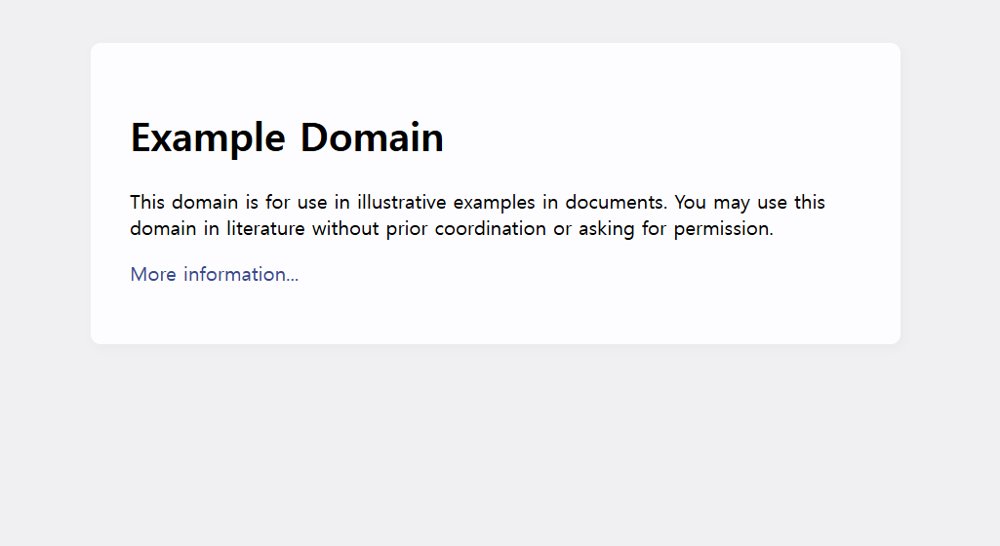

# 웹 프로그래밍의 이해

파이썬으로 웹 프로그래밍을 시작하기 전에 웹 프로그래밍의 기본 기술에 대해 이해할 필요가 있다.
이는 파이썬뿐만 아니라 다른 언어를 사용하여 웹 프로그래밍을 하더라도 반드시 이해하고 있어야 하는 필수 기술이다.

웹 프로그래밍은 기본적으로 클라이언트-서버로 이루어진다. 1장에서는 웹 프로그래밍의 기본 개념인 웹 클라이언트와 웹 서버뿐만 아니라,
웹 클라이언트와 웹 서버 간의 통신 규약인 HTTP 프로토콜, 주고받는 메시지 중에서 가장 중요한 URL, 그리고 혼동하기 쉬운 웹 서버와
웹 애플리케이션 서버 간의 차이점과 각각의 특징 등에 대해서 알아보겠다.
---
## **1.1 웹 프로그래밍이란?**

웹 프로그래밍이란 무엇일까? 간단히 말하면 HTTP(s) 프로토콜로 통신하는, 클라이언트와 서버를 개발하는 것이다.
웹 클라이언트와 웹 서버를 같이 개발할 수도 있고, 웹 클라이언트 또는 웹 서버 하나만 개발할 수도 있다.
보통은 웹 서버를 개발하는 경우가 많아서 파이썬 웹 프로그래밍이라고 하면 우선적으로 Django와 같은 프레임워크를 사용해 웹 서버를 개발한다.

웹 브라우저를 실행해 네이버에 접속하는 것도 웹 프로그램이 동작하는 것이다.
이 경우에는 웹 브라우저가 웹 클라이언트이고, 네이버 서버는 웹 서버가 된다. 
즉, 웹 클라이언트가 요청하고 웹 서버가 응답하는 클라이언트-서버 프로그램이 동작하는 것이다.
Internet Exploerer, Chrome, Firefox와 같은 웹 브라우저는 이미 웹 클라이언트로서 개발되어 있기 때문에 웹 프레임워크를 활용해서 웹 서버를 개발하는 것을 마치 웹 프로그래밍의 전부인 것처럼 착각하기 쉽지만, 실제 프로젝트를 진행하다 보면 웹 클라이언트를 개발해야 되는 상황도 많이 
발생한다.

웹 브라우저 이외에도 웹 서버에 요청을 보내는 웹 클라이언트는 다양하게 만들 수 있는데, 다음과 같이 네 가지로 분류할 수 있다.

- 웹 브라우저를 사용하여 요청
- 리눅스 curl 명령을 사용하여 요청
- Telnet을 사용하여 요청
- 직접 만든 클라이언트로 요청

이에 대해서는 다양한 웹 클라이언트에서 살펴보도록 하겠다.
---
## **1.2 다양한 웹 클라이언트**

네이버와 같은 상용 웹 서버를 사용해도 되지만, 간단한 테스트이므로 여기서는 www.example.com 도메인에 있는 웹 서버를 대상으로 
HTTP 요청request을 보내고 응답Response을 확인해보겠다.

### **1.2.1 웹 브라우저를 사용하여 요청**

다음 그림처럼 웹 브라우저(Chrome)를 열고 주소창에 접속하고자 하는 웹 서버의 URL(www.example.com)을 입력한다.


웹 브라우저는 주소창에 입력된 문장을 해석하여 웹 서버에게 HTTP 요청을 보내는 웹 클라이언트의 역할을 수행한다.
요청을 받은 www.example.com 도메인의 웹 서버는 그 결과를 웹 브라우저로 전송해준다.
웹 브라우저는 전송받은 결과를 사용자가 볼 수 있도록 HTML 텍스트를 해석하여 화면에 보여준다.


---
### **1.2.2 직접 만든 클라이언트로 요청**

이번에는 파이썬 프로그램으로 간단한 웹 클라이언트를 만들어 보았다.
example.py 프로그램이 웹 클라이언트가 된다.
파이썬 라이브러리를 이용해서 단 두 줄로 웹 서버에 HTTP 요청을 보내는 웹 클라이언트를 만들었다.
이제 웹 클라이언트를 실행하고 그 결과를 확인해보자!

```
c:/lecture/personal_study/personal-study/django_study/chapter01_what_is_web_programming/example.py
<!doctype html>
<html>
<head>
    <title>Example Domain</title>

    <meta charset="utf-8" />
    <meta http-equiv="Content-type" content="text/html; charset=utf-8" />
    <meta name="viewport" content="width=device-width, initial-scale=1" />
    <style type="text/css">
    body {
        background-color: #f0f0f2;
        margin: 0;
        padding: 0;
        font-family: -apple-system, system-ui, BlinkMacSystemFont, "Segoe UI", "Open Sans", "Helvetica Neue", Helvetica, Arial, sans-serif;

    }
    div {
        width: 600px;
        margin: 5em auto;
        padding: 2em;
        background-color: #fdfdff;
        border-radius: 0.5em;
        box-shadow: 2px 3px 7px 2px rgba(0,0,0,0.02);
    }
    a:link, a:visited {
        color: #38488f;
        text-decoration: none;
    }
    @media (max-width: 700px) {
        div {
            margin: 0 auto;
            width: auto;
        }
    }
    </style>
</head>

<body>
<div>
    <h1>Example Domain</h1>
    <p>This domain is for use in illustrative examples in documents. You may use this
    domain in literature without prior coordination or asking for permission.</p>
    <p><a href="https://www.iana.org/domains/example">More information...</a></p>
</div>
</body>
</html>
```

웹 클라이언트의 형태는 달라도 동일한 요청에 대해서 동일한 응답을 받는 것을 확인할 수 있다.
또한 반드시 웹 브라우저가 아니더라도 웹 클라이언트의 요청을 보낼 수 있다.

참고로 파이썬에서는 한 문장으로도 HTTP 요청을 보내는 웹 클라이언트를 만들 수 있다.
단, 따옴표를 잘 구분해서 입력해야 한다.

```
import urllib.request; print(urllib.request.urlopen('http://www.example.com').read().decode('utf-8'))
```