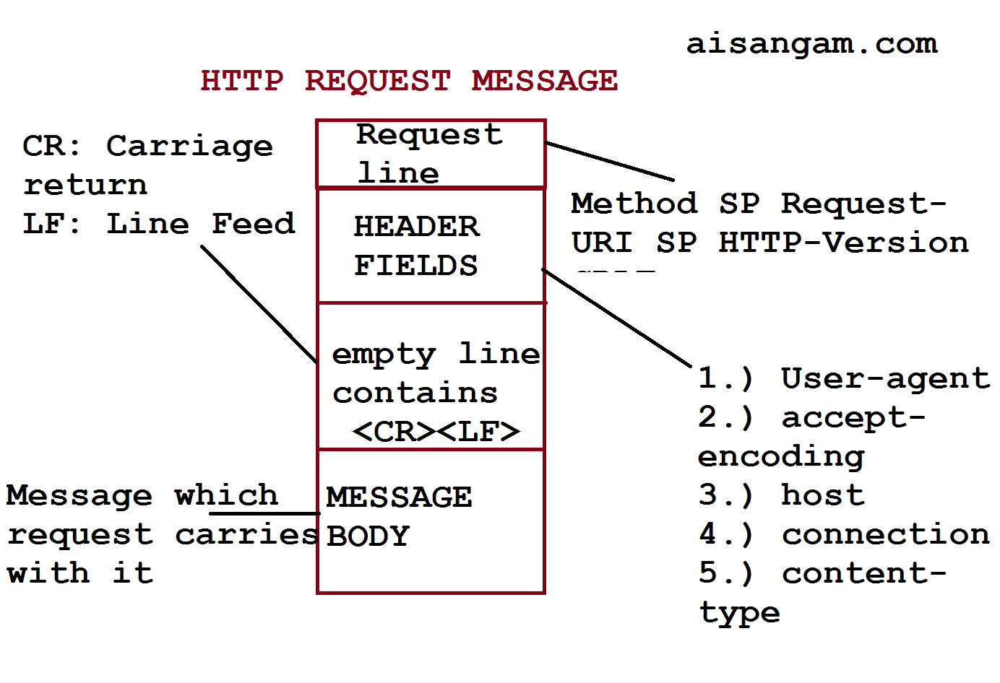
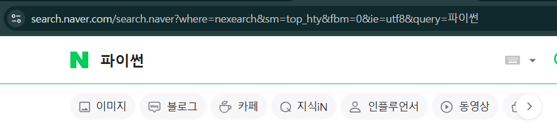

## **1.3 HTTP 프로토콜**

HTTP(Hypertext Transfer Protocol)는 웹 서버와 웹 클라이언트 사이에서 데이터를 주고받기 위해 사용하는 통신 방식으로,
TCP/IP 프로토콜 위에서 동작한다. 즉, 우리가 웹을 이용하려면 웹 서버와 웹 클라이언트는 각각 TCP/IP 동작에 필수적인 IP 주소를 가져야 한다는 의미이다.

HTTP란 이름대로라면 하이퍼텍스트 전송용 프로토콜이지만, 실제로는 HTML이나 XML과 같은 하이퍼텍스트 뿐만 아니라 
이미지, 음성, 동영상, JavaScript, PDF와 각종 오피스 도큐먼트 파일 등 컴퓨터에서 다룰 수 있는 데이터라면 무엇이든 전송할 수 있다.

예를 들면, 우리가 웹 브라우저의 주소창에 http://www.naver.com을 입력하고 enter를 누르면 웹 클라이언트와 웹 서버 사이에 HTTP 연결이 맺어지고,
웹 클라이언트는 웹 서버에 HTTP 요청(request) 메시지를 보내게 된다. 웹 서버는 요청에 따른 처리를 진행한 후 그 결과를 웹 클라이언트에게 
HTTP 응답(response) 메시지로 보낸다. 이런 방식으로 요청 메시지와 응답 메시지가 반복적으로 오가면서 웹을 이용하게 되는 것이다.
---
### **1.3.1 HTTP 메시지 구조**

HTTP 메시지는 클라이언트에서 서버로 보내는 요청 메시지와 서버에서 클라이언트로 보내는 응답 메시지 2가지가 있다.



그림에서 첫 번째는 요청 메시지일 때 요청 라인request line이라고 하고, 응답 메시지일 때 상태 라인status line이라고 한다.
스타트 라인에 이어 헤더는 각 행의 끝에 줄 바꿈 문자인 CRLF(Carriage Return Line Feed)가 있으며, 헤더와 바디는 빈 줄로 구분한다.
헤더와 바디는 생략할 수 있고, 바디에는 텍스트뿐만 아니라 바이너리 데이터도 들어갈 수 있다.

다음은 바디가 없는 요청 메시지의 예시이다.

```
GET /book/shakespeare HTTP/1.1
Host: www.example.com:8080
```
첫 번째 줄은 요청 라인으로, 요청 방식method, 요청 URL, 프로토콜 버전으로 구성된다.
두 번째 줄은 헤더로, 이름: 값 형식으로 표현하며, 위 예시의 경우 헤더가 한 줄 뿐이지만 여러 줄도 가능하다.
또한 Host 항목은 필수로 표시해줘야 하는데, 위 예시처럼 Host 헤더로 표시할 수도 있고, 아래 예시처럼 요청라인의 URL에 Host를 표시하면 Host 헤더는 생략할 수 있다. 만약 포트번호를 표시하고 싶다면 Host 항목에 같이 표시해준다.

```
GET http://www.example.com:8080/book/shakespeare HTTP/1.1
```

다음은 응답 메시지의 예시이다.

```
HTTP/1.1 200 OK
Content-Type: application/xhtml+xml; charset=utf-8

<html>
...
</html>
```

첫 번째 줄의 상태라인은 프로토콜 버전, 상태 코드, 상태 텍스트로 구성된다.
서버에서 처리 결과를 상태 라인에 표시하는데, 위 예시에는 200 OK이므로 정상적으로 처리되었음을 알 수 있다.
그 외의 상태 코드와 텍스트 구문은 [APPENDIX C]를 참고하기를 바란다.

두 번째 줄부터 헤더이다. 위 예시는 헤더 항목이 하나뿐인 응답 메시지로, 이 메시지는 바디를 갖고 있기 때문에 헤더와 바디를 빈 줄로 구분하고 있다.
바디에는 보통 HTML 텍스트가 포함되어 있다.

```
* URI vs URL란?

URI는 Uniform Resource Indentifier의 약자로 URL(Uniform Resource Locator)과 URN(Uniform REsource Name)을 포함하는 좀 더 넣ㅂ은 의미의 
표현이지만, 웹 프로그래밍에서는 URI와 URL을 동일한 의미로 사용해도 무방하다.
```

### **1.3.2 HTTP 처리 방식**

HTTP 메서드method를 통해서 클라이언트가 원하는 처리 방식을 서버에 알려준다.
HTTP 메서드는 8가지로 정의되어 있는데, 이 중에서 가장 많이 사용되는 메서드는 GET, POST, PUT, DELETE 4개의 메서드이며,
데이터 조작의 기본이 되는 CRUD(Create, Read, Update, Delete)와 매핑되는 처리를 한다.

```
GET: 리소스 취득 -> Read(조회)
POST: 리소스 생성, 리소스 데이터 추가 -> Create(생성)
PUT: 리소스 변경 -> Update(변경)
DELETE: 리소스 삭제 -> Delete(삭제)
```
GET 방식은 지정한 URL의 정보를 가져오는 메서드로, 가장 많이 사용된다.
웹 브라우저를 이용하여 서버로부터 웹 페이지, 이밎, 동영상 등을 가져올 때 수많은 GET 방식의 요청을 하게 된다.

POST의 대표적인 기능은 리소스를 생성하는 것으로, 블로그에 글을 등록하는 경우가 이에 해당된다.
PUT은 리소스를 변경하는 데 사용된다. 예를 들어 블로그에서 글을 업로드한 작성자를 변경하거나 글의 내용을 업데이트하는 경우가 이에 해당된다.

PUT 메서드도 리소스를 생성하는 데 사용할 수 있다. 
이런 경우, 굳이 POSR와 PUT의 용도를 구분해야 한다면, 새롭게 생성한 리소스에 대한 URL 결정권이 서버 측에 있을 때 POST를 사용하고,
URL 결정권이 클라이언트에 있을 때 PUT을 사용한다.

그러나 리소스의 생성은 POST, 리소스의 변경은 PUT으로 사용하는 것이 엄밀히 말해 추천한다.
---
### **1.3.1 GET과 POST 메서드**

앞에서 8가지의 HTTP 메서드를 소개했지만, 현실적으로 가장 많이 사용되는 메서드는 GET과 POST 2가지이다.
이것은 HTML의 폼에서 지정할 수 있는 메서드가 GET과 POST 밖에 없기 때문이기도 한다.

폼에서 사용자가 입력한 데이터들을 서버로 보낼 때, GET과 POST는 그 방식에 차이가 있다.
GET은 아래의 예시처럼 URL 부분의 ?뒤에 이름=값 쌍으로 이어붙여 보낸다.

```
GET http://docs.djangoproject.com/search/?q=forms&release=1 HTTP/1.1
```

반면, POST에서는 GET에서 URL에 포함시켰던 파라미터들을 아래 예시처럼 요청 메시지의 바디에 넣는다.

```
POST http://docs.djangoproject.com/search. HTTP/1.1
COntent-Type: application/x-form-urlencoded

q=forms&release=1
```

이렇게 파라미터를 보내는 방식의 차이로 인하여 GET 방식을 이용하면 많은 양의 데이터를 보내기 어렵ㄴ다.
URL은 길이 제한이 있기 때문이다. 또한 전달되는 사용자의 데이터가 웹 브라우저의 주소창에 노출된다는 단점이 있어 보안 측면에서도 불리하다.

따라서 폼을 사용하거나 추가적인 파라미터를 서버로 보내는 경우에는 GET보다 POST 방식을 많이 사용하게 되는데, 
파이썬의 장고 프레임워크에서도 폼의 데이터는 POST 방식만을 사용하고 있다.
위의 단점들이 아무런 영향을 끼치지 않을 경우에는 GET을 사용해도 무방하다.

예를 들어, 네이버의 검색창에서 원하는 단어를 검색해보면 GET 방식이 사용된느 것을 확인할 수 있다.



