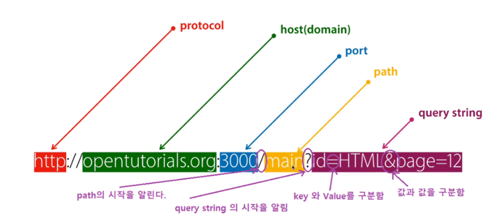

## **1.4 URL 설계**

웹 애플리케이션을 개발할 때, 고객의 요구사항이 정리되면 먼저 디자인 측면에서는 화면 UI를 설계하고, 프로그램 로직 측면에서는 URL을 설계하게 된다. 즉, URL의 설계는 웹 서버 로직 설계의 첫걸음이고, 사용자 또는 웹 클라이언트에게 웹 서버가 가지고 있는 기능을 명시해주는 중요한 단계이다.
전체 프로그램 로직을 생각하면 차후에 로직이 변경되더라도 URL 변경은 최소화할 수 있도록 유연하게 설계하는 것이 중요하다.

URL은 보통 다음과 같이 구성된다.



* URL 스킴: URL에 사용된 프로토콜을 의미한다.
* 호스트명: 웹 서버의 호스트명으로, 도메인명 또는 IP 주소로 표현된다.
* 포트번호: 웹 서버 내의 서비스 포트번호이다. 생략 시에는 디폴트 포트번호로, http는 80을, https는 443을 사용한다.
* 경로: 파일이나 애플리케이션 경로를 의미한다.
* 쿼리스트링: 질의 문자열로, 앰퍼샌드(&)로 구분된 이름=값 쌍 형식으로 표현한다.
* 프라그먼트: 문서 내의 앵커 등 조각을 지정한다.

### **1.4.1 URL을 바라보는 측면**

URL은 웹 클라이언트에서 호출한다는 시점에서 보면, 웹 서버에 존재하는 애플리케이션에 대한 API(Application Programming Interface)라고 할 수 있다. 웹 프로그래밍 기술의 발전 과정을 살펴보면, 이러한 API의 명명 규칙을 정하는 방법을 두 가지로 분류할 수 있다. 하나는 URL을 RPC(Remote procedure Call)로 바라보는 방식이고, 다른 하나는 REST(Representational State Transfer)로 바라보는 방식이다.

RPC란 클라이언트가 네트워크 상에서 원격에 있는 서버가 제공하는 API 함수를 호출하는 방식이다.
이 방식의 배경에는 URL 설계와 API 설계를 동일하게 고려하여 URL의 경로를 API 함수명으로, 쿼리 파라미터를 함수의 인자로 간주한다.
그래서 웹 클라이언트에서 URL을 전송하는 것이 웹 서버의 API 함수를 호출한다고 인식하는 것이다.

RPC 방식에는 URL 경로의 대부분이 동사가 된다.
자바의 일반적인 함수나 메서드명이 동사인 것과 동일한 개념이다.
RPC 방식은 웹 개발 초기부터 사용된 방식으로, 다음에 설명하는 REST 방식이 나오면서 사용 빈도가 줄어드는 추세이지만, 여전히 많이 사용되고 있다.
RPC 방식은 다음과 같은 형태로 사용한다.

```
http://blog.example.com/search?q=test&debug=true
```

URL을 바라보는 또 한 가지 측면은 REST 방식으로 URL을 설계하는 것이다.
REST 방식이란 웹 서버에 존재하는 요소들을 모두 리소스라고 정의하고, URL을 통해 웹 서버의 특정 리소스를 표현한다는 개념이다.
리소스는 시간이 지남에 따라 상태state가 변할 수 있기 때문에 클라이언트와 서버 간에 데이터의 교환을 리소스 상태의 교환(Represemtational State Transfer)으로 간주하고 있다. 
그리고 중요한 점은 리소스에 대한 조작을 GET, POST, PUT, DELETE 등의 HTTP 메서드로 구분한다는 점이다.

이와 같은 REST 방식으로 바라본다면, 웹 클라이언트에서 URL을 전송하는 것이 웹 서버에 있는 리소스 상태에 대한 데이터를 주고받는 것으로 간주될 수 있다.
REST 방식은 다음과 같은 형태로 사용한다.

```
http://blog.example.com/search/test -> GET 메서드 사용
```

### **1.4.2 간편 URL**

최근에는 위에서 설명한 REST 방식의 URL 개념을 기반으로, 간단하면서도 사용자에게 친숙하게 URL을 표현하려는 노력이 진행되었다.
주로 검색 엔진 분야에서 이러한 노력이 많이 진전되었고, 그 결과 기존의 길고 복잡한 URL에서 특수 문자 등을 제거하고 간결하게 만드는 방식인 간편Clean URL이 탄생하게 되었다. 기존 URL 방식에서 사용되는 특수 문자들은 웹 프로그래밍 언어 입장에서는 연산자나 특수한 용도의 기호로 사용될
가능성이 높기 때문에 검색 엔진에서 이런 주소를 저장하고 표현하는 데 풀변이 따르기도 했다.

정리하면, 간편 URL은 쿼리스트링 없이 경로만 가진 간단한 구조의 URL을 말한다. 검색 엔진의 처리를 최적화하기 위해 생겨난 간편한 URL은 
URL을 입력하거나 기억하기 쉽다는 부수적인 장점도 있어, 검색 엔진 친화적 URL(search engine friendly URL) 또는 사용자 친화적 URL(user friendly url)이라고 부르기도 한다.
---
### **1.4.3 파이썬의 우아한 URL**

파이썬 프레임워크에서는 처음부터 간편 URL 체계를 도입했다.
그 외에도 URL을 정의하기 위해 정규표현식Regular expression을 추가적으로 상요할 수 있다.
다음은 장고에서 사용하는 URL의 표현 방식이다.

```
urlpatterns = [
    path('articles/2003/', views.special_case_2003),
    path('articles/<int:year>/', views.year_archive),
    path('articles/<int:year>/<int:month>/', views.month_archive),
    path('articles/<int:year>/<int:month>/<slug:slug>/', views.acticle_detail),
]
```

유사한 의미의 URL을 정규표현식을 사용하여 아래처럼 표현할 수도 있다.
위 예시에서도 연도는 정수이기만 하면 외지만, 아래 예시에서 연도는 숫자 4자리만 가능하다.
정규표현식을 사용하여 URL을 좀 더 구체적으로 표현하는 방식이다.

```
urlpatterns = [
    path('articles/2003/', views.special_case_2003),
    re_path(r^articles/(?P<year>[0-9]{4})/$', views.year_archive),
    re_path(r^articles/(?P<year>[0-9]{4})/(?p<month>[0-9]{2})/$', views.month_archive),
    re_path(r^artivles/(?P<year>[0-9]{4})/(?>month>[0-9]{2})/(?P<slug>[\w-]+)/$', viewS.article_details),
]
```

