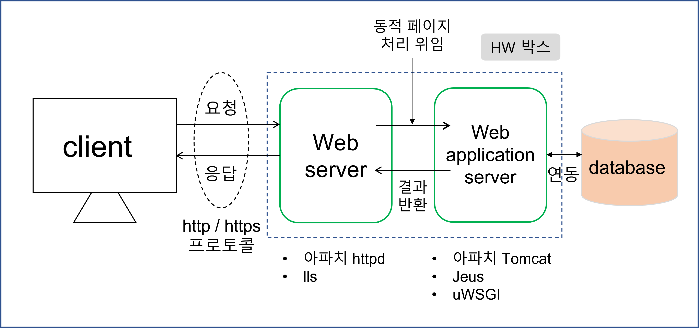

## **1.5 웹 애플리케이션 서버**

웹 클라이언트(보통 웹 브라우저)의 요청을 받아서 처리하는 서버를 통칭하여 웹 서버라고 부르기도 하지만,
좀 더 세분화하여 웹 서버와 웹 애플리케이션 서버라고 구분할 수 있다.

이 두 개의 서버가 어떻게 다른지, 또 웹 애플리케이션 서버가 무엇인지를 이해하기 위해서는 웹 서버 기술의 발전 과정을 알아볼 필요가 있다.
---
### **1.5.1 정적 페이지 vs 동적 페이지**

정적 페이지란 누가, 언제 요구하더라도 항상 같은 내용을 표시하는 웹 페이지를 말한다.
정적 페이지들은 해당 웹 서비스의 제공자가 사전에 준비하여 서버 측에 배치한 것으로, 동일한 리소스URL의 요청에 대해서는 항상 동일한 내용의 페이지를 반환한다.
주로 HTML, 자바스크립트, CSS, 이미지만으로 이루어진 페이지가 해당된다.

반면, 동적 페이지란 동일한 리소스의 요청이라도 누가, 언제, 어떻게 요구했는지에 따라 각각 다른 내용이 반환되는 페이지를 말한다.
예를 들면, 현재 시각을 보여주는 페이지나 온라인 쇼칭 사이트에서 사용자마다 다른 카트 내용을 보여주는 페이지 등이 있다.

정적static, 동적dynamic이란 용어는 사용자가 페이지를 요청하는 시점에 페이지의 내용이 유지되는가 또는 변경되는가를 구분해주는 용어이다.
즉, 동적 페이지에는 프로그래밍 코드가 포함되어 있어서 페이지 요청 시점에 HTML 문장을 만들어내는 것이다.

초창기 웹이 출현했을 떄는 논문 열람 사이트와 같이 정적인 웹 페이지들을 하이퍼링크로 연결하여 보여주는 것이 목적이었고,
웹 서버도 정적인 페이지를 보여주는 것이 주된 역할이었다.
그러나 점차 동적 페이지에 대한 요구사항이 생기고, 필요한 데이터를 저장하고 꺼내오는 등의 데이터베이스 처리에 대한 요구가 많아짐에 따라 
웹 서버와는 다른 별도의 프로그램이 필요하게 되었다.
이러한 별도의 프로그램과 웹 서버 사이에 정보를 주고 받는 규칙을 정의한 것이 바로 CGI(Common Gateway Interface) 규격이다.
---
### **1.5.2 CGI 방식의 단점**

CGI 자체는 정적 프로그래밍 언어나 스크립트가 아니라, 웹 서버와 독립적인 프로그램(프로세스) 사이에 정보를 주고받는 규격을 의미하며,
이 규격을 준수하면 어떤 언어를 사용해도 CGI 프로그램을 개발할 수 있다.
전통적인 CGI 방식은 웹 서버가 C, C++, Perl, PHP, Python 등으로 만들어진 CGI 프로그램을 직접 호출하여 개별 프로세스를 생성하는 방식이다.

CGI 방식의 근본적인 문제점은 각각의 클라이언트 요청에 대해 독립적인 별도의 프로세스가 생성된다는 것이다.
요청이 많아질수록 프로세스가 많아지고, 프로세스가 많아질수록 비례적으로 프로세스가 점유하는 메모리의 요구량도 커져서 시스템에 많은 부하를 준다.
이런 이유로 현재는 CGI 방식을 거의 사용하지 않고, 이러한 단점을 해결하기 위해 대안책으로 여러 기술이 등장했다.
---
### **1.5.3 CGI 방식의 대안 기술**

CGI 방식의 대안 기술 중 하나는 별도의 애플리케이션(CGI 프로그램과 같은 역할을 하는 프로그램)을 Perl, PHP 등의 스크립트 언어로 작성하고,
스크립트를 처리하는 스크립트 엔진(인터프리터)을 웹 서버에 내장시켜서 CGI 방식의 단점이었던 별도의 프로세스를 기동시키는 오버헤드를 줄이는 방식이다.
아파치 웹 서버에서 사용하는 mod_perl 혹은 mode_php 모듈이 Perl이나 PHP 스크립트 엔진을 웹 서버에 내장시켜 애플리케이션의 처리를 고속화하기 위해 개발된 기술들이다. 파이썬의 경우에는 예전의 mod_python 모듈은 더 이상 사용하고 있지 않으며, 현재는 mod_wsgi 모듈을 사용하고 있다.

또 다른 방식은 애플리케이션을 처리하는 프로세스를 미리 데몬으로 기동시켜 놓은 후, 웹 서버의 요청을 데몬에서 처리하는 것이다. 
이 또한 프로세스 생성 부하를 줄일 수 있는 방법이다.
파이썬의 경우에는 데몬 방식에도 mod_wsgi 모듈을 사용한다.
mod_wsgi 모듈은 앞에서처럼 웹 서버 내장 방식으로도 실행 가능하고, 별도의 데몬 방식으로도 실행이 가능하다.

CGI 애플리케이션을 별도의 데몬으로 처리하는 방식은 기술이 점차 발전함에 따라, 스레드 처리가 보강되고 객체 지향 기술이 반영되면서 애플리케이션 전용 데몬인 애플리케이션 서버 방식으로 발전했다. 현재 가장 많이 사용되고 있는 JSP(Java Server Page), ASP(Active Server Page) 기술에서
애플리케이션 서버 방식을 사용하고 있다.

파이썬에서 웹 서버와 연동용으로 사용하는 mod_wsgi, uwsgi, gunicorn 프로그램들이, 웹 서버 프로그램인 httpd, nginx와는 별개의 애플리케이션 전용 데몬으로 동작한다는 점에서 웹 애플리케이션 서버라고 얘기할 수 있다.
---
### **1.5.4 애플리케이션 서버 방식**

애플리케이션 서버 방식은 웹 서버가 직접 프로그래밍을 호출하기보다 아래 그림처럼 웹 애플리케이션 서버를 통해서 간접적으로 웹 애플리케이션 프로그램을 실행한다. 웹 애플리케이션 서버는 애플리케이션 프로그램의 실행 결과를 웹 서버에 전달해주며, 웹 서버는 웹 애플리케이션 서버로부터 전달받은 응답 결과를 웹 클라이언트에 전송한다.

웹 서버와 웹 애플리케이션 서버가 분리됨에 따라, 서로의 역할도 구분하여 사용하는 것이 좋다.
왜냐하면 정적 페이지를 처리하는 경우에 비해 동적 페이지를 처리하는 경우가 수 배에서 수십 배의 메모리를 소비하기 떄문이다.
즉, 정적 페이지 처리에 특화된 웹 서버는 정적 페이지만 처리하고, 웹 애플리케이션 서버는 동적 페이지만 처리하도록 역할을 분담하는 것이 웹 애플리케이션 서버에서 정적 페이지와 동적 페이지를 모두 처리하는 것보다 훨씬 더 많은 요청을 처리할 수 있다.

두 서버의 역할은 전문화되는 방향으로 계속해서 발전하고 있다. 웹 서버는 정적 페이지를 웹 클라이언트에게 제공하는 것이 주 역할이지만, 그 외에도 캐시 기능, 프록시 기능 등의 추가적인 기능을 제공한다.
또한, 다수의 클라이언트로부터 동시에 요청을 받아 처리해야 하기 때문에 동시에 접속을 허가하는 클라이언트의 수의 제한 및 처리 프로세스의 관리, 요청 및 응답에 관한 로그의 기록, 안정성 확보를 위한 인증 제어 및 암호화 관리 등 HTTP/HTTPS의 제어에 필요한 여러 기능을 제공한다.

웹 애플리케이션 서버는 웹 서버보다 기능이 더 추가되고, 종류도 다양해지고 있다.
그 이유는 웹 애플리케이션 서버는 웹 서버와의 연동 규격을 잘 따르기만 하면, 임의의 언어 플랫폼을 사용해서 애플리케이션 프로그램을 작성하고 실행시킬 수 있기 때문이다. 자바 계역의 Tomcat, 루비 계열의 Unicorn, 파이썬 계열의 uWSGI 애플리케이션 서버 등이 대표적인 예이다.
대다수의 웹 애플리케이션 서버는 웹 클라이언트로부터 직접 요청을 받아 처리하는 웹 서버의 기능을 제공한다.
그러나 이러한 웹 애플리케이션 서버 내의 웹 서버 기능들이 성능과 안정성 측면에서는 적합하지 않기 때문에 개발용으로만 제한적으로 사용되고, 운용 환경이나 대규모의 사이트에서는 잘 사용되지 않는다.
---
### **1.5.5 웹 서버와의 역할 구분**

지금까지 웹 서버 및 웹 애플리케이션 서버라는 용어를 사용했는데, 이는 SW 측면의 서버 프로그램을 의미한다.
이들은 HW 측면의 용어를 의미할 때도 있는데, 본 절에서는 좀 더 정확하게 구분하기 위해 HW 측면의 용어는 웹 서버 박스 및 웹 애플리케이션 서버 박스라는 용어를 사용하도록 하겠다.

앞 절에서도 설명했듯이, 거의 모든 웹 사이트가 정적 페이지와 정적 페이지를 같이 제공하는 환경에서 웹 서버 또는 웹 애플리케이션 서버 하나만으로 서비스하는 것은 매우 비효율적이다. 정적 페이지를 처리할 때와 동적 페이지를 처리할 때의 서버 자원 소요량이 다르기 떄문이다.

따라서 웹 서버와 웹 애플리케이션 서버 프로그램이 함께 필요하며, 이 두 개의 서버를 동일한 HW 박스에서 기동시키는 것도 충분히 가능한 구성이다.
서비스 운용 관리 측면에서 하나의 HW 박스에 구성하는 것이 좀 더 간편한 방식이기 때문이다.

이렇게 하나의 HW 박스에 웹 서버와 웹 애플리케이션 서버를 모두 탑재하는 것도 가능하지만, HW 박스를 분리하여 구성하면 메모리 효율을 더욱 더 높일 수 있다. 정적 페이지를 처리하는 웹 서버와 동적 페이지를 처리하는 웹 애플리케이션 서버 박스 간의 메모리 사이즈 비율을 조정할 수 있기 때문이다.
물론 이를 위해서는 해당 웹 사이트의 트래픽 중 정적 페이지와 동적 페이지 요청 건수 비율을 분석해야 한다.

그래서 대형 웹 사이트에서는 HW 증설에 의해 웹 처리 용량을 높이는 작업이 용이하도록, 웹 서버를 탑재하는 HW 박스와 웹 애플리케이션 서버를 탑재하는 HW 박스를 분리하여 구성하는 것이 보통이다.
이런 경우 HW 측면에서 L4 또는 L7 스위치 및 리버스 프록시 HW 박스 등의 도입을 고려하여 구성하게 된다.