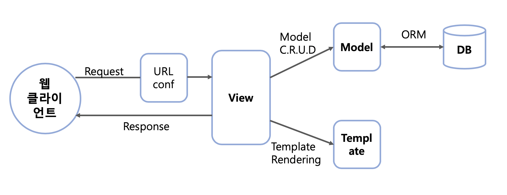

## **3.3 장고에서의 애플리케이션 개발 방식**

웹 개발 또는 웹 서비스 개발이란 용어를 좀 더 정확하게 표현하면, 웹 애플리케이션 개발이라고 할 수 있다.
그러면 웹 애플리케이션이란 무엇일까?

웹 사이트를 설계할 때 가장 먼저 해야할 일은 프로그램이 해야 할 일을 적당한 크기로 나누어서 모듈화하는 것이다.
이 경우, 웹 사이트의 전체 프로그램 또는 모듈화된 단위 프로그램을 애플리케이션이라고 한다.
즉, 프로그램으로 코딩할 대상을 애플리케이션이라고 부르는 것이다.

그러나 장고에서는 용어를 사용할 때, 애플리케이션의 개념을 웹 서버 개발 측면에서 좀 더 구체화하고 있다.
웹 사이트에 대한 전체 프로그램을 프로젝트(Project)라 하고, 모듈화된 단위 프로그램을 애플리케이션(Application)이라 부른다.
즉, 애플리케이션 프로그램들이 모여서 프로젝트를 개발하는 개념이다. 이에 대해서는 실습 과정을 통해 다시 다루도록 하겠다.
장고는 기본적으로 MVT 패턴에 따라 애플리케이션을 개발하도록 유도해주는데, 먼저 MVT 패턴에 대해 살펴보겠다.
---
### **3.3.1 MVT 패턴**

웹 프로그램 개발 시 일반적으로 언급되는 MVC(Model-View-Controller) 패턴이란 데이터(Model), 사용자 인터페이스(View), 데이터를 처리하는 로직(Controller)을 구분해서 한 요소가 다른 요소들에 영향을 주지 않도록 설계하는 방식이다.
이런 방식으로 개발을 진행하면 UI 디자이너는 데이터 관리나 애플리케이션 로직에 신경 쓰지 않고도 화면 UI를 설계할 수 있고, 로직이나 데이터를 설계하는 개발자도 화면 디자인은 디자이너에게 맡기고 자신의 설계 및 개발 업무에만 집중할 수 있게 된다.
파이썬도 이러한 MVC 개념을 그대로 받아들였는데, 용어는 다르게 사용하고 있다.

장고 프레임워크에서는 View를 Template, Controller를 View라고 표현하며, MVC를 MVT(Model-View-Template) 패턴이라고 한다.
모델은 데이터베이스에 저장되는 데이터를 의미하는 것이고, 템플릿은 사용자에게 보여지는 UI 부분을, 뷰는 실질적으로 프로그램 로직이 동작하여 데이터를 가져오고 적절하게 처리한 결과를 템플릿에 전달하는 역할을 수행한다.

예를 들면, 모델은 블로그의 내용을 데이터베이스로부터 가지고 오거나 저장, 수정하는 기능을, 뷰는 버튼을 눌렀을 때 어떤 함수를 호출하며 데이터를 어떻게 가공할 것인지 결정하는 역할을, 템플릿은 화면 출력을 위해 디자인과 테마를 적용해서 보여지는 페이지를 만들어주는 역할을 담당한다.
다음은 사용자 요청에 반응하는 MVT 패턴들의 각 요소가 어떻게 연결되는지를 보여준다.

웹 클라이언트의 요청을 받고, 장고에서 MVT 패턴에 따라 처리하는 과정을 요약하면 다음과 같다.

* 클라이언트로부터 요청을 받으면 URLconf를 이용하여 URL을 분석한다.
* URL 분석 결과를 통해 해당 URL에 대한 처리를 담당할 뷰를 결정한다.
* 뷰는 자신의 로직을 실행하면서, 만일 데이터베이스 처리가 필요하면 모델을 통해 처리하고 그 결과를 반환받는다.
* 뷰는 자신의 로직 처리가 끝나면 템플릿을 사용하여 클라이언트에 전송할 HTML 파일을 생성한다.
* 뷰는 최종 결과로 HTML 파일을 클라이언트에게 보내 응답한다.

### **3.3.6 MVT 코딩 순서**

모델, 뷰, 템플릿 중에서 무엇을 먼저 코딩해야 하는지에 대해 정해진 순서는 없다.
MVT 방식에 따르면 화면 설계는 뷰와 템플릿 코딩으로 연결되고, 테이블 설계는 모델 코딩에 반영된다.
그렇기 때문에 독립적으로 개발할 수 있는 모델을 먼저 코딩하고, 뷰와 템플릿은 서로 영향을 미치므로 모델 이후에 같이 코딩하는 것이 일반적이다.

뷰와 템플릿의 코딩 순서도 굳이 정할 필요는 없지만, 필자는 UI 화면을 생각하면서 로직을 풀어나가는 것이 쉽기 때문에 보통은 템플릿을 먼저 코딩한다.
다만, 클래스형 뷰(CBV; Class-Based View)처럼 뷰의 코딩이 매우 간단한 경우에는 뷰를 먼저 코딩하고, 그 다음 템플릿을 코딩한다.

* 프로젝트 뼈대 만들기: 프로젝트 및 앱 개발에 필요한 디렉터리와 파일 생성
* 모델 코딩하기: 테이블 관련 사항을 개발(models.py, admin.py 파일)
* URLconf 코딩하기: URL 및 뷰 매핑 관계를 정의(ruls.py 파일)
* 템플릿 코딩하기: 화면 UI 개발(templates/디렉터리 하위의 *.html 파일들)
* 뷰 코딩하기: 애플리케이션 로직 개발(views.py 파일)

### **애플리케이션 설계하기**

이제부터 