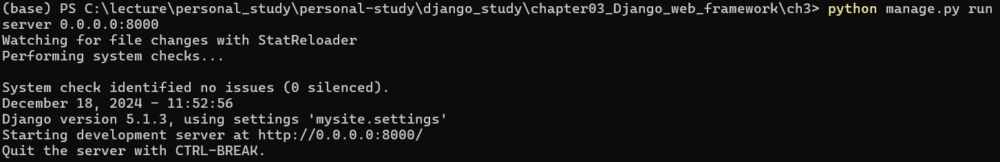
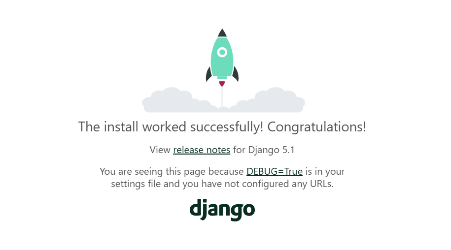
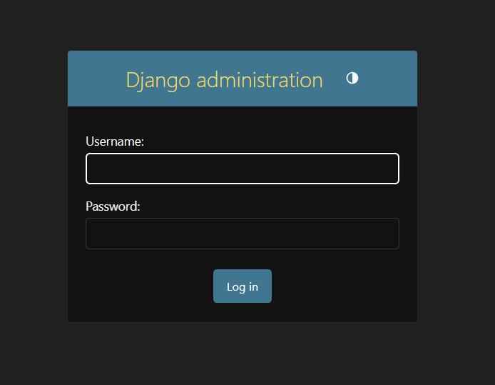
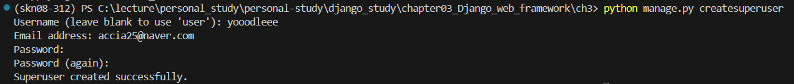
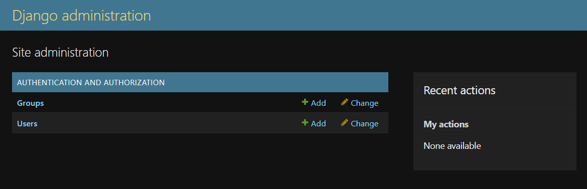

## **3.5 프로젝트 뼈대 만들기**

코딩은 프로젝트 뼈대를 만드는 것에서부터 시작한다.
즉 프로젝트에 필요한 디렉터리 및 파일을 구성하고, 설정 파일을 셋팅한다.
그 외에도 기본 테이블을 생성하고, 관리자 계정인 슈퍼유저를 생성하는 것이 일반적이다. 
프로젝트가 만들어지면 그 하위에 애플리케이션 디렉터리 및 파일을 구성한다.
장고는 이런 작업을 위한 장고 쉘 커맨드를 제공한다.

프로젝트가 완성된 후에는 templates, static, logs 등의 디렉터리가 더 필요하다.
또한 개발자가 필요하다고 판단되면 개발을 진행하면서 임의로 추가해도 무방하다.
각 디렉터리 및 파일의 용도는 다음과 같다.

* 루트 디렉터리: 프로젝트 관련 디렉터리 및 파일을 모아주는 최상위 루트 디렉터리이다.
                보통 settings.py 파일의 BASE_DIR 항목으로 지정된다.
* manage.py: 장고의 명령어를 처리하는 파일이다.
* urls.py: 프로젝트 레벨의 URL 패턴을 정의하는 최상위 URLconf이다. 보통은 애플리케이션 디렉터리마다 하위 urls.py 파일이 또 있다.
* wsgi.py: Apache와 같은 웹 서버와 WSGI 규격으로 연동하기 위한 파일이다.

프로젝트 뼈대를 만들기 위해서 다음과 같은 순서로 명령을 실행한다.

```
>django-admin startproject mysite   // mysite라는 프로젝트를 생성
>python manage.py startapp polls    // polls라는 애플리케이션을 생성함
>notepad settings.py                // 설정 파일을 확인 및 수정함
>python manage.py migrate           // 데이터베이스에 기본 테이블을 생성함
>python manage.py runserver         // 현재까지 작업을 개발용 웹 서버로 확인함
```

### **3.5.1 프로젝트 생성**

가장 먼저 아래의 명령으로 mysite라는 프로젝트를 만든다.
mysite는 원하는 프로젝트 명칭을 입력하면 된다.

```
>django-admin startproject mysite
```

그러면 장고가 필요한 디렉터리 및 파일을 생성해준다.
자세히 보면 명령 실행 시 입력한 mysite라는 디렉터리가 최상위와 그 하위, 두 군데에 생긴 것을 알 수 있다.

하위 mysite 디렉터리는 프로젝트 디렉터리이고, 상위 mysite 디렉터리는 프로젝트 관련 디렉터리/파일을 모으는 역할만 하는 디렉터리이다.
상위 mysite 디렉터리는 특별한 의미를 가지고 있지 않기 때문에 이름을 변경해도 무방하다.
하위의 프로젝트 디렉터리 이름과 동일해서 혼동할 수 있으므로 ch3이라고 변경하겠다.
---
### **3.5.2 애플리케이션 생성**

다음은 프로젝트 루트 디렉터리 ch3으로 이동해서 polls라는 애플리케이션을 만드는 명령을 실행한다.
polls는 원하는 애플리케이션 명칭을 입력하면 된다.

```
>python manage.py startapp polls
```

그러면 장고가 polls라는 애플리케이션 디렉터리와 그 하위에 필요한 파일들을 생성해준다.
생성된 파일들의 이름을 살펴보도록 하자.

파일 이름도 장고에서 지어준 것인데, 이 또한 장고의 특징이다.
모든 애플리케이션 개발에 반드시 필요한 파일들은 장고가 알아서 생성해주고, 개발자들은 그 내용을 채워넣기만 하면 된다.
즉, 개발자들이 어떤 파일들을 만들어야 할지 고민할 필요가 없어졌다.
어느 파일에 어떤 내용을 채워야 할지는 이름만 봐도 짐작이 가겠지만, 차츰 설명하도록 하겠다.
---
### **3.5.3 프로젝트 설정 파일 변경**

프로젝트에 필요한 설정값들은 settings.py 파일에 지정한다.
settings.py 파일은 프로젝트의 전반적인 사항들을 설정해주는 곳으로, 루트 디렉터리를 포함한 각종 디렉터리의 위치, 로그의 형식,
프로젝트에 포함된 애플리케이션의 이름 등이 지정되엉 있다.

지금은 예제 프로젝트를 진행하는 데 필요한 사항, 네 가지만 확인하겠다.
아래 명령으로 프로젝트 설정 파일인 settings.py 파일을 연다.

```
>notepad settings.py
```

첫 번째로 ALLOWED_HOSTS 항목을 적절하게 지정해야 한다.
장고는 DEBUG=True이면 개발 모드로, False이면 운영 모드로 인식한다.
ALLOWED_HOSTS에 반드시 서버의 IP나 도메인을 지정해야 하고, 개발 모드인 경우에는 값을 지정하지 않아도 
['localhost', '127.0.0.1']로 간주한다.

지금은 개발 모드이고 장고의 runserver를 가동할 서버의 IP가 127.0.0.1Qnsaks dkslfk 192.168.56.101일 수도 있다면 다음과 같이 지정한다.

```
>ALLOWED_HOSTS = ['192.168.56.101', 'localhost', '127.0.0.1']
```

두 번째로 프로젝트에 포함되는 애플리케이션들은 모두 설정 파일에 등록되어야 한다.
따라서 개발하고 있는 polls라는 애플리케이션도 등록해야 한다.
애플리케이션을 등록할 때는 간단하게 애플리케이션의 모듈명인 polls만 등록해도 되지만, 애플리케이션의 설정 클래스도 등록하는 것이 더 정확한 방법이다.

polls 앱의 설정 클래스는 startapp polls 명령 시에 자동 생성된 apps.py 파일에 PollsConfig라고 정의되어 있다.
그래서 장고가 설정 클래스를 찾을 수 있도록 모델 경로까지 포함하여 'polls.apps.PollsConfig'라고 등록한다.

```
INSTALLED_APPS = [
    "django.contrib.admin",
    "django.contrib.auth",
    "django.contrib.contenttypes",
    "django.contrib.sessions",
    "django.contrib.messages",
    "django.contrib.staticfiles",
    "polls.apps.PollsConfig",   # 추가
]
```

세 번째로 프로젝트에 사용할 데이터베이스 엔진이다.
장고는 디폴트로 SQLite3 데이터베이스 엔진을 사용하도록 설정되어 있다.
물론 다른 데이터베이스 엔진으로 변경할 수도 있다.
만일 MySQL이나 Oracle, PostgreSQL 등 다른 데이터베이스로 변경하고 싶다면 settings.py 파일에서 수정해주면 된다.
우리 예제에서는 SQLite3 데이터베이스를 사용할 것이므로, 설정된 사항을 변경하지 않고 확인만 한다.

```
# Database
# https://docs.djangoproject.com/en/5.1/ref/settings/#databases

DATABASES = {
    "default": {
        "ENGINE": "django.db.backends.sqlite3",
        "NAME": BASE_DIR / "db.sqlite3",
    }
}
```

네 번째는 타임존 지정이다.
최초에는 세계표준시(UTC)로 되어 있는데, 한국 시간으로 변경한다.

```
TIME_ZONE = "Asia/Seoul"
```

### **3.5.4 기본 테이블 생성**

다음은 기본 테이블 생성을 위해 아래 명령을 실행한다.
migrate 명령은 데이터베이스에 변경사항이 있을 때 이를 반영해주는 명령이다.

```
>python manage.py migrate
```

그런데 아직 데이터베이스 테이블을 만들지도 않았는데, 왜 이 명령이 필요할까?
장고는 모든 웹 프로젝트 개발 시 반드시 사용자와 그룹 테이블 등이 필요하다는 가정 하에 설계되었다.
그래서 우리가 테이블을 전혀 만들지 않았더라도, 사용자 및 그룹 테이블 등을 만들어주기 위해 프로젝트 개발 시작 시점에 이 명령을 실행하는 것이다.
명령을 실행하면 migrate 명령에 대한 로그가 보이고, 실행 결과로 SQLite3 데이터베이스 파일인 db.sqlite3 파일이 생성된 것을 확인할 수 있다.
---
### **3.5.5 지금까지 작업 확인하기**

지금까지는 프로젝트의 뼈대에 해당하는 프로젝트 디렉터리, 애플리케이션 디렉터리를 비롯해 관련 파일들 그리고 사용자 및 그룹 테이블을 만들었다.
이러한 작업만으로도 장고가 제공해주는 웹 페이지와 테이블을 확인할 수 있다.

확인을 위해서 웹 서버를 실행하고, 그 웹 서버에 접속해보겠다.
장고에서는 개발 과정 도중에 현재 상태를 확인해볼 수 있도록 runserver라는 간단한 테스트용 웹 서버를 제공해준다.
웹 서버를 실행하기 위해 다음 명령을 입력한다.
하나의 창에서 작업해도 되지만 runserver용으로 별도의 cmd 창을 열어 사용하는 것이 편리하다.

```
>python manage.py runserver 0.0.0.0:8000    // or 0:8000
```



명령 입력 시 자신의 서버에 맞는 IP 주소와 포트번호를 입력하면 된다.
위 명령에서 0.0.0.0이란 IP 주소의 의미는 현재 명령을 실행 중인 서버의 IP 주소가 무엇으로 설정되어 있더라도
그와는 무관하게 웹 접속 요청을 받겠다는 의미이다.
즉, 웹 브라우저의 주소창에서는 runserver를 실행 중인 서버의 실제 IP 주소를 입력하면 된다.

위와 같이 runserver가 정상적으로 실행되었다면, 이제 웹 브라우저를 열고 주소창에 다음과 같이 입력한다.
IP 주소는 runserver가 동작하는 서버 IP 주소를 적어준다.

```
http://127.0.0.1:8000
```

다음 처림 장고의 환영 메시지가 나타나면 정상이다.



이제 장고에서 기본적으로 제공하는 Admin 사이트에 접속해서 테이블이 생성된 것을 확인해보겠다.
웹 브라우저의 주소창에 다음과 같이 입력한다.
IP 주소와 포트번호는 앞에서와 동일하고, URL 경로만 /admin으로 변경했다.

```
http://127.0.0.1:8000/admin
```

다음 화면처럼 Admin 사이트의 로그인 페이지가 나오면 정상이다.



로그인하려면 Username, Password를 넣어야 하는데 아직 생성하지 않았다.
그러므로 Admin 사이트에 로그인하기 위한 관리자(슈퍼유저)를 만들어보겠다.
우선 다음 명령을 입력한다.

```
>python manage.py createsuperuser
```

다음과 같이 Username/Email/Password/Password(again)을 입력해서 관리자를 생성한다.



생성된 관리자의 Username/Password로 좀전의 Admin 사이트에 로그인하겠다.
로그인이 완료되면 다음과 같은 화면이 나타난다.



장고에서 만들어준 User와 Groups 테이블이 생성된 것을 확인할 수 있다.
지금까지 작업이 정상적으로 진행된 것이다.

이 Admin 사이트에서 Users와 Groups 테이블을 포함하여 앞으로 만들 테이블에 대한 데이터의 입력, 변경, 삭제 등의 작업을 할 수 있다.
한 가지 설명을 덧붙이자면 Admin 화면에서 기본적으로 Users와 Groups 테이블이 보이는 것은 이미 settings.py 파일에 django.contrib.auth
애플리케이션이 등록되었기 때문이다.
즉, 장고에서 기본으로 제공하는 auth 앱에 Users와 Groups 테이블이 미리 정의되어 있는 것이다.

여기까지 프로젝트의 뼈대를 만들고, 처음 프로젝트 생성 시 장고에서 기본적으로 제공하는 Admin 기능에 대해 살펴보았다.
기억할 점은 애플리케이션을 MVT 패턴 방식으로 개발할 수 있도록 골격이 만들어졌다는 것이다.