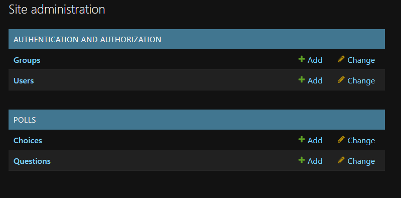

## **3.6 애플리케이션 개발하기 = Model 코딩**

모델 작업은 데이터베이스에 테이블을 생성하는 작업이다.
다음 순서대로 진행한다.

```
>notepad models.py                      // 테이블을 정의
>notepad admins.py                      // 정의된 테이블이 Admin 화면에 보이게 함
>python manage.py makemigrations        // 데이터베이스에 변경이 필요한 사항을 추출함
>python manage.py migrate               // 데이터베이스에 변경사항을 반영함
>python manage.py runserver             // 현재까지 작업을 개발용 웹 서버로 확인함
```

### **3.6.1 테이블 정의**

앞에서 설계했던 것처럼, polls 애플리케이션은 Question과 Choice 두 개의 테이블이 필요하다.
테이블은 models.py 파일에 정의한다.
앞에서 테이블을 설계한 내용에 따라 다음과 같이 입력하면 된다.

```
from django.db import models

class Question(models.Model):
    question_text = models.CharField(max_length=200)
    pub_date = models.DateTimeField('date published')

    def __str__(self):
        return self.question_text


class Choice(models.Model):
    question = models.ForeignKey(Question, on_delete=models.CASCADE)
    choice_text = models.CharField(max_length=200)
    votes = models.IntegerChoices(default=0)

    def __str__(self):
        return self.choice_text
```

장고에서는 테이블을 하나의 클래스로 정의하고, 테이블의 컬럼은 클래스의 변수(속성)로 매핑한다.
테이블 클래스는 django.db.models.Model 클래스를 상속받아 정의하고, 각 클래스 변수의 타입도 장고에서 미리 정의된 필드 클래스를 사용한다.

클래스 변수명은 칼럼명을 그대로 매핑해주면 된다.
필드 클래스는 직관적으로 이해가 될 것이라 짐작하지만 몇 가지 유의할 사항이 있다.

* PK(Primary Key)는 클래스에 지정해주지 않아도, 장고는 항상 PK에 대한 속성을 Not Null 및 Autoincrement로, 이름을 id로 해서 자동으로 만들어준다.
* DataTimeField() 필드 클래스에 정의한 data published는 pub_date 칼럼에 대한 레이블 문구이다. 나중에 설명하는 Admin 사이트에서 이 문구를 보게 될 것이다.
* FK(Foreign Key)는 항상 다른 테이블의 PK에 연결되므로, Question 클래스의 id변수까지 지정할 필요 없이 Question 클래스만 지정하면 된다. 실제 테이블에서 FK로 지정된 칼럼은 _id 접미사가 붙는다는 점도 알아두기 바란다.
* __str__() 메서드는 객체를 문자열로 표현할 때 사용하는 함수이다. 나중에 보게 될 Admin 사이트나 장고 쉘 등에서 테이블 명을 보여줘야 하는데, 이때 __str__() 메서드를 정의하지 않으면 테이블명이 제대로 표시되지 않는다.

### **3.6.2 Admin 사이트에 테이블 반영**

Admin 사이트에 접속해보면 현재까지는 장고에서 기본적으로 제공하는 Users, Groups 테이블만 보인다.
이제 models.py 파일에서 정의한 테이블도 Admin 사이트에 보이도록 등록하겠다.
다음처럼 admin.py 파일에 등록해주면 된다.

```
from django.contrib import admin
from polls.models import Question, Choice

admin.site.register(Question)
admin.site.register(Choice)
```

models.py 모듈에서 정의한 Question, Choice 클래스를 임포트하고, admin.site.register() 함수를 사용하여 
임포트한 클래스를 Admin 사이트에 등록해주면 된다.
이와 같이 테이블을 새로 만들 때는 models.py와 admin.py 두 개의 파일을 함께 수정해야 한다는 것을 기억해야 한다.

---
### **3.6.3 데이터베이스 변경사항 반영**

테이블의 신규 생성, 테이블의 정의 변경 등 데이터베이스에 변경이 필요한 사항이 있으면, 이를 데이터베이스에 실제로 반영해주는 작업을 해야 한다.
아직까지는 클래스로 테이블을 정의만 변경한 상태이다.
다음 명령으로 변경사항을 데이터베이스에 반영한다.

```
>python manage.py makemigrations
>python manage.py migrate
```

마이그레이션(migrations)이란 용어는 장고 1.7 버전부터 사용된 개념으로, 테이블 및 필드의 생성, 삭제, 변경 등과 같이
데이터베이스에 대한 변경사항을 알려주는 정보이다.
물리적으로는 애플리케이션 디렉터리별로 마이그레이션 파일이 존재한다.
즉, 우리 예제에서는 makemigrations 명령에 의해 polls/migrations 디렉터리 하위에 마이그레이션 파일들이 생기고, 이 마이그레이션 파일들을 이용해 migrate 명령으로 데이터베이스에 테이블을 만들어준다.

---
### **3.6.4 지금까지 작업 확인하기**

지금까지 데이터베이스 관련 사항을 작업했다.
즉, models.py 파일에 테이블을 정의하고 이를 데이터베이스에 반영하는 명령을 실행했다.
또한 테이블을 Admin 사이트에도 등록했다.
지금까지의 작업이 정상적으로 잘 처리되었는지 확인하기 위해 Admin 사이트에 접속해보겠다.

만일 runserver가 실행되지 않았다면 앞에서 설명한 것처럼 runserver를 실행시키고, 웹 브러우저 주소창에 다음과 같이 입력한다.

```
http://127.0.0.1:8000/admin
```

